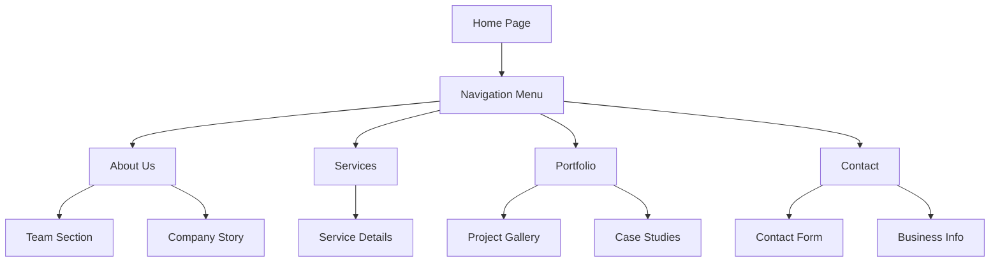

## 1. Product Overview
Transform the current single-page SummitPixels website into a professional multi-page architecture with enhanced branding, improved navigation spacing, and personalized visual elements. This transformation will provide better user experience, improved SEO capabilities, and a more comprehensive online presence for SummitPixels.

The multi-page structure will allow for better content organization, improved search engine optimization, and enhanced user navigation while maintaining the existing brand identity and professional aesthetic.

## 2. Core Features

### 2.1 User Roles
| Role | Registration Method | Core Permissions |
|------|---------------------|------------------|
| Website Visitor | No registration required | Browse all pages, view content, contact forms |
| Admin | Secure login system | Content management, image uploads, SEO settings |

### 2.2 Feature Module
The multi-page website will consist of the following main pages:
1. **Home page**: Hero section, services overview, portfolio highlights, testimonials, contact CTA.
2. **About Us page**: Company story, team introduction, mission/vision, company values, professional headshots.
3. **Services page**: Service categories, detailed descriptions, pricing information, service process.
4. **Portfolio page**: Work samples, project galleries, client case studies, before/after showcases.
5. **Contact page**: Contact form, location information, business hours, multiple contact methods.

### 2.3 Page Details
| Page Name | Module Name | Feature description |
|-----------|-------------|---------------------|
| Home | Hero Section | Display "SummitPixels" logo, compelling headline, subheadline, CTA buttons. Increased spacing below navigation. |
| Home | Services Overview | Grid layout of main services with icons and brief descriptions. |
| Home | Portfolio Highlights | Featured work samples with hover effects and quick view functionality. |
| Home | Testimonials | Client reviews with ratings and project details. |
| Home | Contact CTA | Prominent contact section with form and business information. |
| About Us | Company Story | Narrative section explaining SummitPixels history and evolution. |
| About Us | Team Section | Professional headshots, names, roles, and brief bios. |
| About Us | Mission/Vision | Company values, goals, and future aspirations. |
| About Us | Company Stats | Key metrics and achievements with animated counters. |
| Services | Service Categories | Organized service offerings with detailed descriptions. |
| Services | Pricing Information | Transparent pricing tiers or custom quote options. |
| Services | Process Overview | Step-by-step explanation of service delivery. |
| Portfolio | Project Gallery | Filterable portfolio grid with categories and tags. |
| Portfolio | Case Studies | Detailed project breakdowns with challenges and solutions. |
| Portfolio | Client Testimonials | Project-specific client feedback and results. |
| Contact | Contact Form | Multi-field form with validation and submission handling. |
| Contact | Business Information | Address, phone, email, business hours. |
| Contact | Map Integration | Interactive location map with directions. |
| Global | Navigation | Responsive navigation with active page highlighting, "SummitPixels" logo. |
| Global | Footer | Consistent footer across all pages with links and contact info. |
| Global | SEO Optimization | Meta tags, structured data, Open Graph tags for each page. |

## 3. Core Process

### Visitor Flow

### User Journey Examples
1. **New Visitor**: Home → Services → Portfolio → Contact
2. **Returning Client**: Home → Portfolio → About Us → Contact
3. **Referral Visitor**: Portfolio → Services → About Us → Contact

## 4. User Interface Design

### 4.1 Design Style
- **Primary Colors**: Professional blue (#2563eb), clean white (#ffffff), light gray (#f8fafc)
- **Typography**: Modern sans-serif fonts with clear hierarchy
- **Logo**: "SummitPixels" text logo with mountain icon, responsive sizing
- **Layout**: Clean, spacious design with consistent spacing and alignment
- **Images**: High-quality, relevant imagery with proper optimization
- **Animations**: Subtle hover effects and smooth transitions

### 4.2 Page Design Overview
| Page Name | Module Name | UI Elements |
|-----------|-------------|-------------|
| Home | Hero Section | Large "SummitPixels" logo, bold headline (48px), subheadline (20px), dual CTA buttons, increased top padding (120px). |
| Navigation | Logo Area | Mountain icon + "SummitPixels" text, h-12 on desktop, h-10 on mobile. |
| About | Team Photos | Professional headshots (200x200px), circular crop, hover effects. |
| Portfolio | Gallery Grid | Responsive grid (3 columns desktop, 2 tablet, 1 mobile), hover overlays. |
| Services | Service Cards | Card-based layout with icons, consistent spacing, hover animations. |
| Contact | Form Layout | Clean form fields, clear labels, submit button, validation states. |

### 4.3 Responsiveness
- **Desktop-first approach**: Optimized for 1920px+ screens
- **Tablet adaptation**: 768px-1024px with adjusted layouts
- **Mobile optimization**: 320px-767px with touch-friendly elements
- **Navigation**: Collapsible mobile menu with hamburger icon
- **Image optimization**: Responsive images with srcset for different screen sizes
- **Spacing adjustments**: Dynamic padding/margin based on viewport

### 4.4 Visual Enhancements
- **Professional Images**: High-quality stock photos and custom photography
- **Image Optimization**: WebP format, lazy loading, proper alt tags
- **Brand Consistency**: Colors, fonts, and spacing aligned with SummitPixels identity
- **Accessibility**: Proper contrast ratios, keyboard navigation, screen reader support
- **Performance**: Optimized loading times, compressed assets, efficient code structure