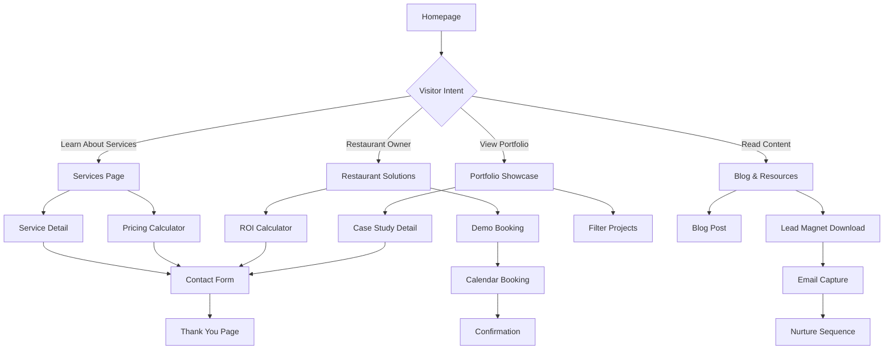

## 1. Product Overview
SummitPixel Inc. is a digital solutions agency that transforms businesses through custom web development, mobile applications, and restaurant technology solutions. This enhancement project aims to elevate the existing Next.js website to a professional, high-converting platform that establishes market leadership in the digital agency space.

The enhanced website will serve as a powerful lead generation tool, showcasing expertise through compelling case studies, implementing advanced UX patterns, and optimizing for search engines and conversions. Target clients include restaurant owners, small-to-medium businesses, and enterprises seeking digital transformation.

## 2. Core Features

### 2.1 User Roles
| Role | Registration Method | Core Permissions |
|------|---------------------|------------------|
| Website Visitor | No registration required | Browse all content, submit contact forms, download resources |
| Potential Client | Email capture through forms | Access to detailed case studies, consultation booking |
| Admin/Content Manager | Secure admin panel login | Create/edit blog posts, manage portfolio, view analytics |

### 2.2 Feature Module
Our professional digital agency website consists of the following enhanced pages:

1. **Enhanced Homepage**: Advanced hero section with video background, interactive animations, client testimonials carousel, and conversion-optimized CTAs.
2. **Services Page**: Detailed service breakdowns with interactive pricing calculators, service comparison tools, and consultation booking integration.
3. **Restaurant Solutions Hub**: Specialized restaurant technology showcase with ROI calculators, demo booking system, and industry-specific case studies.
4. **Portfolio Showcase**: Filterable project gallery with detailed case studies, client testimonials, project timelines, and technology stacks.
5. **Blog & Resources**: Content marketing hub with category filtering, search functionality, related posts, and lead magnet integration.
6. **About & Team Page**: Company story, team member profiles, company culture showcase, and career opportunities.
7. **Contact & Consultation**: Multi-step contact forms, appointment scheduling, live chat integration, and location maps.
8. **Case Study Detail**: In-depth project analysis with before/after metrics, client testimonials, and similar projects.

### 2.3 Page Details
| Page Name | Module Name | Feature description |
|-----------|-------------|---------------------|
| Enhanced Homepage | Video Hero Section | Auto-playing background video with overlay text, scroll-triggered animations, and professional motion graphics. |
| Enhanced Homepage | Interactive Trust Indicators | Real-time counters, client logos carousel, awards showcase, and review platform integration. |
| Enhanced Homepage | Conversion Forms | Multi-step lead capture forms with progressive profiling and instant qualification. |
| Services Page | Service Detail Cards | Expandable service descriptions with pricing tiers, feature comparisons, and ROI calculators. |
| Services Page | Interactive Pricing Tool | Dynamic pricing calculator based on project scope, timeline, and complexity factors. |
| Restaurant Solutions | Demo Booking System | Integrated calendar scheduling for restaurant POS demonstrations and consultations. |
| Restaurant Solutions | ROI Calculator | Interactive tool showing potential savings and revenue increases from restaurant technology. |
| Portfolio Showcase | Advanced Filtering | Multi-criteria filtering by industry, technology, project size, and completion date. |
| Portfolio Showcase | Case Study Gallery | Masonry layout with hover effects, project details modal, and client testimonial integration. |
| Blog & Resources | Content Management | Rich text editor, SEO optimization tools, category management, and featured image handling. |
| Blog & Resources | Lead Magnets | Downloadable resources gated by email capture with automated follow-up sequences. |
| Contact Page | Advanced Forms | Multi-step forms with validation, file upload capabilities, and spam protection via honeypot and reCAPTCHA. |
| Contact Page | Appointment Scheduling | Integrated calendar booking with timezone detection and automatic confirmation emails. |
| Case Study Detail | Metrics Dashboard | Interactive charts showing project results, timeline visualization, and budget breakdown. |
| Site-wide | Analytics Integration | Google Analytics 4, conversion tracking, heatmap integration, and custom event tracking. |
| Site-wide | Performance Optimization | Image optimization, lazy loading, code splitting, and CDN integration for sub-3-second load times. |
| Site-wide | Accessibility Features | WCAG 2.1 AA compliance with screen reader support, keyboard navigation, and high contrast mode. |

## 3. Core Process

### Visitor Journey Flow
1. **Discovery**: Visitor arrives via search, social media, or referral
2. **Engagement**: Captivating hero section with video background grabs attention
3. **Trust Building**: Social proof elements establish credibility
4. **Education**: Service pages provide detailed information and value propositions
5. **Qualification**: Interactive tools help visitors self-qualify
6. **Conversion**: Multi-step forms capture leads with progressive profiling
7. **Nurturing**: Automated email sequences provide additional value
8. **Sales**: Consultation booking system enables direct sales conversations

### Admin Content Management Flow
1. **Content Creation**: Admin creates new blog posts, portfolio items, or case studies
2. **SEO Optimization**: Built-in tools optimize content for search engines
3. **Publishing**: Content goes live with automatic social media promotion
4. **Performance Monitoring**: Analytics track content performance and engagement
5. **Lead Management**: Contact forms automatically create CRM entries
6. **Follow-up**: Automated email sequences nurture leads based on interests

## 4. User Interface Design

### 4.1 Design Style
- **Primary Colors**: Deep blue (#1a365d) with gradient variations, clean white backgrounds
- **Secondary Colors**: Professional gray palette (#2d3748, #718096) with accent blue (#0066ff)
- **Typography**: Inter font family with hierarchical sizing (14px body, 16px headings, 48px+ hero)
- **Button Style**: Rounded corners (8px radius), subtle shadows, hover animations
- **Layout Style**: Card-based design with generous whitespace, asymmetric grids for visual interest
- **Icon Style**: Lucide React icons with consistent 2px stroke width, blue accent colors
- **Animation**: Framer Motion for smooth transitions, scroll-triggered animations, micro-interactions
- **Visual Elements**: Gradient overlays, subtle patterns, professional photography, custom illustrations

### 4.2 Page Design Overview
| Page Name | Module Name | UI Elements |
|-----------|-------------|-------------|
| Homepage | Video Hero | Full-screen background video with overlay gradient, animated text reveal, floating CTA buttons |
| Homepage | Trust Section | Client logo carousel with hover effects, animated counter statistics, award badges |
| Services | Service Cards | Expandable cards with icon animations, hover states revealing additional details |
| Portfolio | Project Grid | Masonry layout with category filters, hover zoom effects, loading animations |
| Blog | Article Cards | Featured image with overlay, reading time indicators, category tags with colors |
| Contact | Multi-step Form | Progress indicator, field validation states, success animations |
| Case Study | Metrics Section | Animated charts, before/after comparison sliders, testimonial carousels |

### 4.3 Responsiveness
- **Desktop-First**: Designed for 1440px+ screens with progressive enhancement
- **Mobile Optimization**: Touch-friendly interactions, swipe gestures, collapsible navigation
- **Breakpoint Strategy**: 320px (mobile), 768px (tablet), 1024px (desktop), 1440px (large desktop)
- **Performance**: Lazy loading for images, code splitting for faster mobile loads
- **Accessibility**: Touch targets minimum 44px, high contrast mode support, screen reader optimization