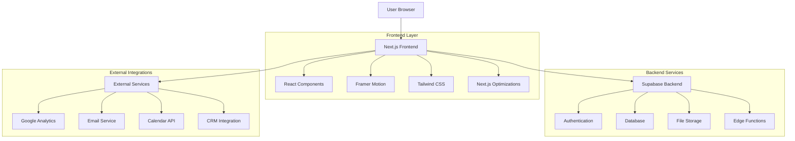
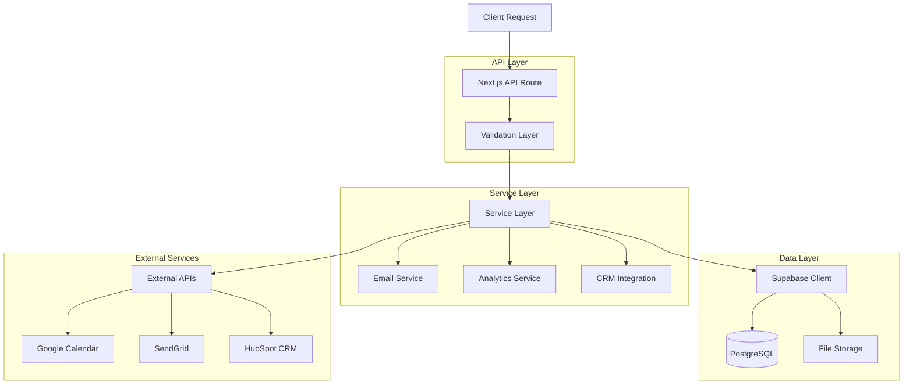
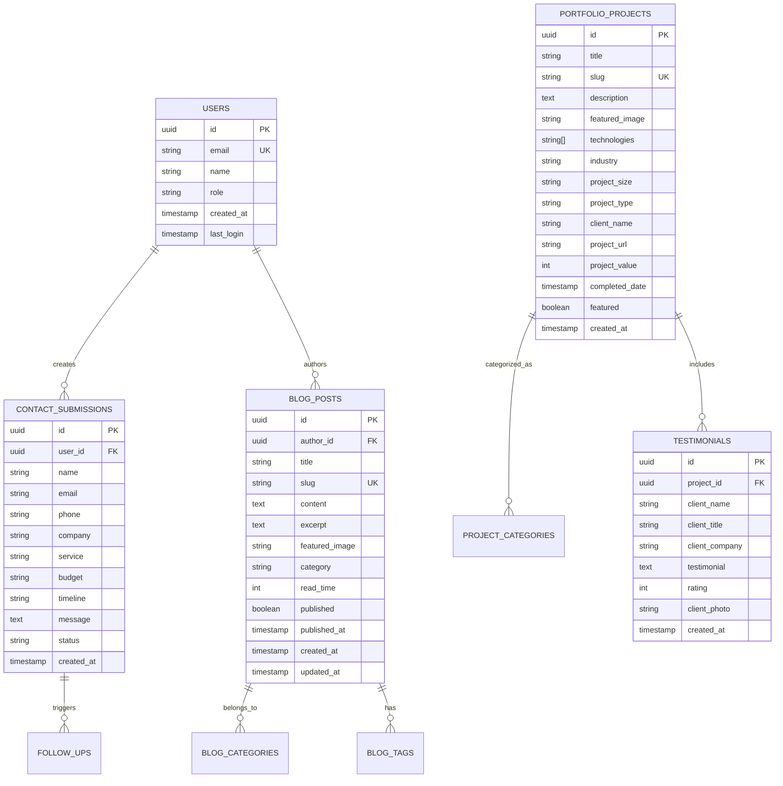

## 1. Architecture Design



## 2. Technology Description

### Frontend Stack
- **Framework**: Next.js 16.0.1 with React 19.2.0
- **Styling**: Tailwind CSS v4 with custom design system
- **Animations**: Framer Motion v12.23.24 for advanced interactions
- **Forms**: React Hook Form v7.66.0 with Zod validation
- **Icons**: Lucide React v0.553.0 for consistent iconography
- **Analytics**: @next/third-parties v16.0.1 for Google Analytics integration

### Backend Services
- **Database**: Supabase (PostgreSQL) with real-time subscriptions
- **Authentication**: Supabase Auth with social logins
- **File Storage**: Supabase Storage for images and documents
- **Edge Functions**: Serverless functions for external API calls
- **Email**: Resend/SendGrid integration for transactional emails

### Development Tools
- **Initialization**: Next.js CLI with TypeScript
- **Linting**: ESLint v9 with Next.js configuration
- **TypeScript**: v5 with strict mode enabled
- **Package Manager**: npm with lock file

## 3. Route Definitions

| Route | Purpose | Features |
|-------|---------|----------|
| `/` | Enhanced Homepage | Video hero, animations, trust indicators, conversion forms |
| `/services` | Services Overview | Service cards, pricing calculator, consultation booking |
| `/services/[slug]` | Service Detail | Detailed descriptions, case studies, related services |
| `/restaurant-solutions` | Restaurant Hub | ROI calculator, demo booking, industry-specific content |
| `/portfolio` | Portfolio Showcase | Filterable gallery, project cards, case study previews |
| `/portfolio/[slug]` | Case Study Detail | In-depth analysis, metrics, testimonials, similar projects |
| `/blog` | Blog & Resources | Article listings, category filtering, search functionality |
| `/blog/[slug]` | Blog Post | Rich content, related posts, author info, lead magnets |
| `/about` | About & Team | Company story, team profiles, culture showcase |
| `/contact` | Contact & Consultation | Multi-step forms, appointment scheduling, location info |
| `/api/contact` | Contact API | Form submission handling, validation, email notifications |
| `/api/blog` | Blog API | Content management, search, filtering |
| `/api/analytics` | Analytics API | Event tracking, conversion monitoring |

## 4. API Definitions

### 4.1 Contact Form API
```
POST /api/contact
```

Request:
| Param Name | Param Type | Required | Description |
|------------|------------|----------|-------------|
| name | string | true | Full name of the contact |
| email | string | true | Valid email address |
| phone | string | false | Phone number with validation |
| company | string | false | Company/organization name |
| service | string | true | Selected service category |
| budget | string | false | Project budget range |
| timeline | string | false | Expected project timeline |
| message | string | true | Detailed project description |
| honeypot | string | false | Spam protection field |

Response:
| Param Name | Param Type | Description |
|------------|------------|-------------|
| success | boolean | Submission status |
| message | string | Success/error message |
| leadId | string | Generated lead identifier |

### 4.2 Blog Content API
```
GET /api/blog?category=string&limit=number&offset=number
```

Query Parameters:
| Param Name | Param Type | Required | Description |
|------------|------------|----------|-------------|
| category | string | false | Filter by category slug |
| limit | number | false | Number of posts to return (default: 10) |
| offset | number | false | Pagination offset (default: 0) |
| search | string | false | Search term for content filtering |

Response:
```json
{
  "posts": [
    {
      "id": "uuid",
      "title": "Post Title",
      "slug": "post-slug",
      "excerpt": "Post excerpt...",
      "featuredImage": "image-url",
      "category": "category-name",
      "readTime": 5,
      "publishedAt": "2024-01-01T00:00:00Z"
    }
  ],
  "total": 25,
  "categories": ["web-development", "mobile-apps"]
}
```

### 4.3 Analytics Tracking API
```
POST /api/analytics/track
```

Request:
| Param Name | Param Type | Required | Description |
|------------|------------|----------|-------------|
| event | string | true | Event name (e.g., 'form_submission', 'page_view') |
| properties | object | false | Additional event properties |
| userId | string | false | User identifier if available |
| sessionId | string | true | Session identifier |

## 5. Server Architecture Diagram



## 6. Data Model

### 6.1 Database Schema



### 6.2 Data Definition Language

#### Users Table
```sql
CREATE TABLE users (
    id UUID PRIMARY KEY DEFAULT gen_random_uuid(),
    email VARCHAR(255) UNIQUE NOT NULL,
    name VARCHAR(255) NOT NULL,
    role VARCHAR(50) DEFAULT 'user' CHECK (role IN ('admin', 'editor', 'user')),
    created_at TIMESTAMP WITH TIME ZONE DEFAULT NOW(),
    last_login TIMESTAMP WITH TIME ZONE,
    email_verified BOOLEAN DEFAULT FALSE
);

-- Indexes for performance
CREATE INDEX idx_users_email ON users(email);
CREATE INDEX idx_users_created_at ON users(created_at DESC);
```

#### Contact Submissions Table
```sql
CREATE TABLE contact_submissions (
    id UUID PRIMARY KEY DEFAULT gen_random_uuid(),
    user_id UUID REFERENCES users(id) ON DELETE SET NULL,
    name VARCHAR(255) NOT NULL,
    email VARCHAR(255) NOT NULL,
    phone VARCHAR(20),
    company VARCHAR(255),
    service VARCHAR(100) NOT NULL,
    budget VARCHAR(50) CHECK (budget IN ('under_5k', '5k_10k', '10k_25k', '25k_50k', '50k_plus')),
    timeline VARCHAR(50) CHECK (timeline IN ('urgent', '1_month', '3_months', '6_months', 'flexible')),
    message TEXT NOT NULL,
    status VARCHAR(50) DEFAULT 'new' CHECK (status IN ('new', 'contacted', 'qualified', 'proposal_sent', 'closed_won', 'closed_lost')),
    source VARCHAR(100),
    ip_address INET,
    user_agent TEXT,
    created_at TIMESTAMP WITH TIME ZONE DEFAULT NOW()
);

-- Performance indexes
CREATE INDEX idx_contact_submissions_created_at ON contact_submissions(created_at DESC);
CREATE INDEX idx_contact_submissions_status ON contact_submissions(status);
CREATE INDEX idx_contact_submissions_service ON contact_submissions(service);
```

#### Portfolio Projects Table
```sql
CREATE TABLE portfolio_projects (
    id UUID PRIMARY KEY DEFAULT gen_random_uuid(),
    title VARCHAR(255) NOT NULL,
    slug VARCHAR(255) UNIQUE NOT NULL,
    description TEXT NOT NULL,
    featured_image VARCHAR(500),
    technologies TEXT[], -- Array of technology names
    industry VARCHAR(100) NOT NULL,
    project_size VARCHAR(50) CHECK (project_size IN ('small', 'medium', 'large', 'enterprise')),
    project_type VARCHAR(100) NOT NULL,
    client_name VARCHAR(255),
    client_testimonial TEXT,
    project_url VARCHAR(500),
    project_value INTEGER,
    completion_date DATE,
    featured BOOLEAN DEFAULT FALSE,
    published BOOLEAN DEFAULT TRUE,
    created_at TIMESTAMP WITH TIME ZONE DEFAULT NOW(),
    updated_at TIMESTAMP WITH TIME ZONE DEFAULT NOW()
);

-- Indexes for filtering and search
CREATE INDEX idx_portfolio_industry ON portfolio_projects(industry);
CREATE INDEX idx_portfolio_featured ON portfolio_projects(featured) WHERE featured = TRUE;
CREATE INDEX idx_portfolio_published ON portfolio_projects(published) WHERE published = TRUE;
CREATE INDEX idx_portfolio_created_at ON portfolio_projects(created_at DESC);
```

#### Blog Posts Table
```sql
CREATE TABLE blog_posts (
    id UUID PRIMARY KEY DEFAULT gen_random_uuid(),
    author_id UUID REFERENCES users(id) ON DELETE SET NULL,
    title VARCHAR(255) NOT NULL,
    slug VARCHAR(255) UNIQUE NOT NULL,
    content TEXT NOT NULL,
    excerpt VARCHAR(500),
    featured_image VARCHAR(500),
    category VARCHAR(100) NOT NULL,
    tags TEXT[], -- Array of tag names
    read_time INTEGER DEFAULT 5,
    seo_title VARCHAR(255),
    seo_description VARCHAR(500),
    published BOOLEAN DEFAULT FALSE,
    published_at TIMESTAMP WITH TIME ZONE,
    views INTEGER DEFAULT 0,
    created_at TIMESTAMP WITH TIME ZONE DEFAULT NOW(),
    updated_at TIMESTAMP WITH TIME ZONE DEFAULT NOW()
);

-- Indexes for blog functionality
CREATE INDEX idx_blog_posts_published_at ON blog_posts(published_at DESC) WHERE published = TRUE;
CREATE INDEX idx_blog_posts_category ON blog_posts(category);
CREATE INDEX idx_blog_posts_author ON blog_posts(author_id);
```

### 6.3 Row Level Security (RLS)

Enable Row Level Security for data protection:

```sql
-- Contact submissions RLS
ALTER TABLE contact_submissions ENABLE ROW LEVEL SECURITY;
CREATE POLICY "Users can view their own submissions" ON contact_submissions
    FOR SELECT USING (auth.uid() = user_id);
CREATE POLICY "Admins can view all submissions" ON contact_submissions
    FOR SELECT USING (EXISTS (
        SELECT 1 FROM users WHERE id = auth.uid() AND role = 'admin'
    ));

-- Blog posts RLS
ALTER TABLE blog_posts ENABLE ROW LEVEL SECURITY;
CREATE POLICY "Published posts are viewable by everyone" ON blog_posts
    FOR SELECT USING (published = TRUE);
CREATE POLICY "Authors can edit their own posts" ON blog_posts
    FOR UPDATE USING (auth.uid() = author_id);
CREATE POLICY "Admins can manage all posts" ON blog_posts
    FOR ALL USING (EXISTS (
        SELECT 1 FROM users WHERE id = auth.uid() AND role = 'admin'
    ));
```

### 6.4 Sample Data Initialization

```sql
-- Insert sample portfolio projects
INSERT INTO portfolio_projects (title, slug, description, industry, project_type, client_name, project_value, completion_date, featured)
VALUES 
    ('Modern Restaurant POS System', 'restaurant-pos-system', 'Complete digital transformation for a multi-location restaurant chain including custom POS integration and mobile ordering app.', 'restaurant', 'web_development', 'Bistro Chain Inc.', 75000, '2024-01-15', true),
    ('E-commerce Mobile App', 'ecommerce-mobile-app', 'Native mobile application for fashion retailer with AR try-on features and integrated payment processing.', 'retail', 'mobile_development', 'Fashion Forward', 120000, '2023-12-01', true),
    ('Corporate Website Redesign', 'corporate-website-redesign', 'Complete redesign of Fortune 500 company website with focus on lead generation and brand storytelling.', 'corporate', 'web_development', 'Tech Corp Solutions', 45000, '2023-11-15', false);

-- Insert sample blog categories
INSERT INTO blog_posts (title, slug, content, excerpt, category, published, published_at)
VALUES 
    ('10 Ways Restaurant Technology Increases Revenue', 'restaurant-tech-revenue', 'Full article content here...', 'Discover how modern POS systems and mobile ordering can boost your restaurant revenue by 30%.', 'restaurant-technology', true, NOW()),
    ('Mobile App Development Best Practices', 'mobile-app-best-practices', 'Full article content here...', 'Learn the essential practices for building successful mobile applications that users love.', 'mobile-development', true, NOW());
```

## 7. Performance Optimization Strategy

### Core Web Vitals Targets
- **Largest Contentful Paint (LCP)**: < 2.5 seconds
- **First Input Delay (FID)**: < 100 milliseconds  
- **Cumulative Layout Shift (CLS)**: < 0.1
- **Time to First Byte (TTFB)**: < 600 milliseconds

### Optimization Techniques
1. **Image Optimization**: Next.js Image component with WebP format, responsive sizing
2. **Code Splitting**: Dynamic imports for non-critical components
3. **Font Optimization**: Subset fonts, preconnect to font providers
4. **Caching Strategy**: ISR for static content, browser caching policies
5. **Bundle Analysis**: Regular webpack bundle analysis and optimization
6. **Database Indexing**: Strategic indexes for common query patterns
7. **API Response Caching**: Redis integration for frequently accessed data