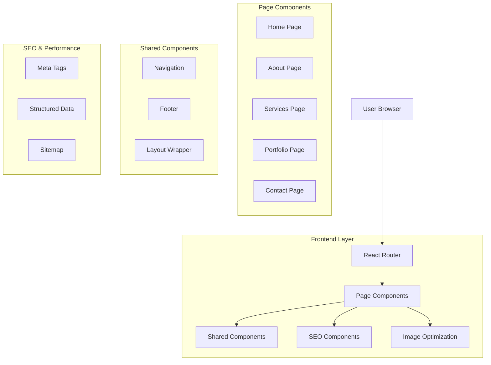

## 1. Architecture Design



## 2. Technology Description

* **Frontend**: React\@18 + TypeScript + Vite

* **Routing**: React Router DOM\@6

* **Styling**: Tailwind CSS\@3 + PostCSS

* **Image Optimization**: Vite Image Optimizer

* **SEO**: React Helmet Async

* **Icons**: Lucide React

* **Initialization Tool**: vite-init

* **Backend**: None (Static deployment)

## 3. Route Definitions

| Route        | Purpose                                                      | Component       |
| ------------ | ------------------------------------------------------------ | --------------- |
| `/`          | Home page with hero, services overview, portfolio highlights | `Home.tsx`      |
| `/about`     | Company story, team, mission/vision                          | `About.tsx`     |
| `/services`  | Detailed service offerings and pricing                       | `Services.tsx`  |
| `/portfolio` | Work samples and project galleries                           | `Portfolio.tsx` |
| `/contact`   | Contact form and business information                        | `Contact.tsx`   |
| `/*`         | 404 error page for undefined routes                          | `NotFound.tsx`  |

## 4. File Structure

```
src/
├── components/
│   ├── shared/
│   │   ├── Navigation.tsx      # Responsive navigation with logo
│   │   ├── Footer.tsx         # Consistent footer across pages
│   │   ├── Layout.tsx         # Page wrapper with SEO
│   │   └── SEOHead.tsx        # Meta tags and structured data
│   ├── home/
│   │   ├── Hero.tsx           # Hero section with increased spacing
│   │   ├── ServicesPreview.tsx # Service overview grid
│   │   ├── PortfolioPreview.tsx # Featured work samples
│   │   └── ContactCTA.tsx     # Contact call-to-action
│   ├── about/
│   │   ├── CompanyStory.tsx   # Company narrative section
│   │   ├── TeamSection.tsx    # Team member profiles with photos
│   │   ├── MissionVision.tsx  # Company values and goals
│   │   └── CompanyStats.tsx   # Key metrics display
│   ├── services/
│   │   ├── ServiceCategories.tsx # Service organization
│   │   ├── PricingInfo.tsx      # Pricing tiers
│   │   └── ProcessSteps.tsx     # Service delivery process
│   ├── portfolio/
│   │   ├── ProjectGallery.tsx   # Filterable project grid
│   │   ├── CaseStudies.tsx      # Detailed project breakdowns
│   │   └── ProjectFilters.tsx   # Category/tag filtering
│   └── contact/
│       ├── ContactForm.tsx      # Multi-field contact form
│       ├── BusinessInfo.tsx     # Location and hours
│       └── MapIntegration.tsx   # Interactive location map
├── pages/
│   ├── Home.tsx                 # Home page component
│   ├── About.tsx                # About page component
│   ├── Services.tsx             # Services page component
│   ├── Portfolio.tsx              # Portfolio page component
│   ├── Contact.tsx                # Contact page component
│   └── NotFound.tsx               # 404 error page
├── hooks/
│   ├── usePageTitle.ts          # Dynamic page title management
│   ├── useImageOptimization.ts # Image loading and optimization
│   └── useScrollPosition.ts     # Navigation scroll behavior
├── utils/
│   ├── seo.ts                   # SEO helper functions
│   ├── imageHelpers.ts          # Image processing utilities
│   └── constants.ts             # Site-wide constants
└── types/
    ├── pages.ts                  # Page component types
    ├── seo.ts                    # SEO-related types
    └── images.ts                 # Image optimization types
```

## 5. Component Architecture

### Navigation Component

```typescript
interface NavigationProps {
  currentPage: string;
  logoText: "SummitPixels";
}

const Navigation: React.FC<NavigationProps> = ({ currentPage, logoText }) => {
  // Responsive navigation with logo mark + text
  // Increased spacing calculations
  // Mobile hamburger menu
  // Active page highlighting
}
```

### SEO Head Component

```typescript
interface SEOHeadProps {
  title: string;
  description: string;
  keywords: string[];
  ogImage?: string;
  structuredData?: object;
}

const SEOHead: React.FC<SEOHeadProps> = ({ title, description, keywords, ogImage, structuredData }) => {
  // Dynamic meta tags
  // Open Graph tags
  // JSON-LD structured data
  // Canonical URLs
}
```

### Image Optimization Component

```typescript
interface OptimizedImageProps {
  src: string;
  alt: string;
  sizes: {
    mobile: string;
    tablet: string;
    desktop: string;
  };
  loading?: "lazy" | "eager";
  className?: string;
}

const OptimizedImage: React.FC<OptimizedImageProps> = ({ src, alt, sizes, loading = "lazy", className }) => {
  // Responsive image handling
  // WebP format conversion
  // Lazy loading implementation
  // Alt tag optimization
}
```

## 6. Implementation Details

### Logo Implementation

```typescript
// Navigation logo with responsive sizing
const Logo = () => (
  <div className="flex items-center space-x-2">
    
    <span className="text-xl md:text-2xl font-bold text-primary">
      SummitPixels
    </span>
  </div>
);
```

### Navigation Spacing

```typescript
// Increased spacing between navigation and hero content
const HeroSection = () => (
  <section className="pt-32 md:pt-40 lg:pt-48">
    {/* Hero content with proper spacing */}
  </section>
);
```

### Page Routing

```typescript
// App.tsx with React Router setup
import { BrowserRouter, Routes, Route } from 'react-router-dom';

function App() {
  return (
    <BrowserRouter>
      <Routes>
        <Route path="/" element={<Home />} />
        <Route path="/about" element={<About />} />
        <Route path="/services" element={<Services />} />
        <Route path="/portfolio" element={<Portfolio />} />
        <Route path="/contact" element={<Contact />} />
        <Route path="*" element={<NotFound />} />
      </Routes>
    </BrowserRouter>
  );
}
```

## 7. SEO Implementation

### Meta Tags Configuration

```typescript
// SEO constants for each page
export const SEO_CONFIG = {
  home: {
    title: "SummitPixels - Professional Digital Services",
    description: "Transform your business with SummitPixels' professional digital services including web design, development, and digital marketing.",
    keywords: ["web design", "digital services", "SummitPixels", "professional services"]
  },
  about: {
    title: "About SummitPixels - Our Story & Team",
    description: "Learn about SummitPixels' journey, our talented team, and our mission to deliver exceptional digital solutions.",
    keywords: ["about", "team", "company story", "SummitPixels"]
  },
  // Additional page configurations...
};
```

### Structured Data

```typescript
// JSON-LD structured data for SEO
export const generateStructuredData = (page: string, data: any) => {
  const baseData = {
    "@context": "https://schema.org",
    "@type": "WebSite",
    "name": "SummitPixels",
    "url": "https://summitpixels.com"
  };
  
  // Page-specific structured data
  switch (page) {
    case 'home':
      return {
        ...baseData,
        "@type": "WebSite",
        "mainEntity": {
          "@type": "Organization",
          "name": "SummitPixels",
          "description": "Professional digital services provider"
        }
      };
    case 'about':
      return {
        ...baseData,
        "@type": "AboutPage",
        "mainEntity": {
          "@type": "Organization",
          "name": "SummitPixels"
        }
      };
    // Additional page types...
  }
};
```

## 8. Image Optimization Strategy

### Image Sources

* **Hero Images**: High-quality hero backgrounds for each page

* **Team Photos**: Professional headshots in About section

* **Portfolio Images**: Project screenshots and work samples

* **Service Icons**: Custom icons for service categories

### Optimization Techniques

```typescript
// Image optimization configuration
export const IMAGE_CONFIG = {
  formats: ['webp', 'jpg', 'png'],
  sizes: {
    thumbnail: { width: 300, height: 200 },
    medium: { width: 600, height: 400 },
    large: { width: 1200, height: 800 },
    hero: { width: 1920, height: 1080 }
  },
  quality: 85,
  lazyLoading: true,
  placeholder: 'blur'
};
```

## 9. Performance Optimization

### Code Splitting

```typescript
// Lazy loading for page components
const About = lazy(() => import('./pages/About'));
const Services = lazy(() => import('./pages/Services'));
const Portfolio = lazy(() => import('./pages/Portfolio'));
const Contact = lazy(() => import('./pages/Contact'));
```

### Bundle Optimization

* Tree shaking for unused code elimination

* Image compression and format optimization

* CSS purging for unused styles

* Font optimization and subsetting

## 10. Deployment Configuration

### Build Process

```json
// package.json build configuration
{
  "scripts": {
    "build": "vite build",
    "preview": "vite preview",
    "optimize-images": "vite optimize-images"
  }
}
```

### Static Hosting

* Vercel, Netlify, or GitHub Pages compatible

* SPA routing configuration for client-side routing

* Asset optimization and CDN integration

* SEO-friendly static generation options

